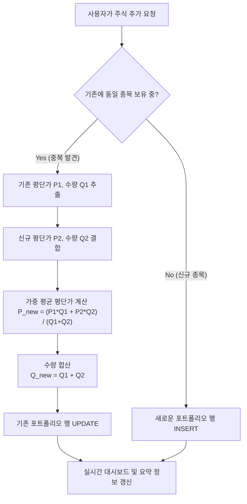
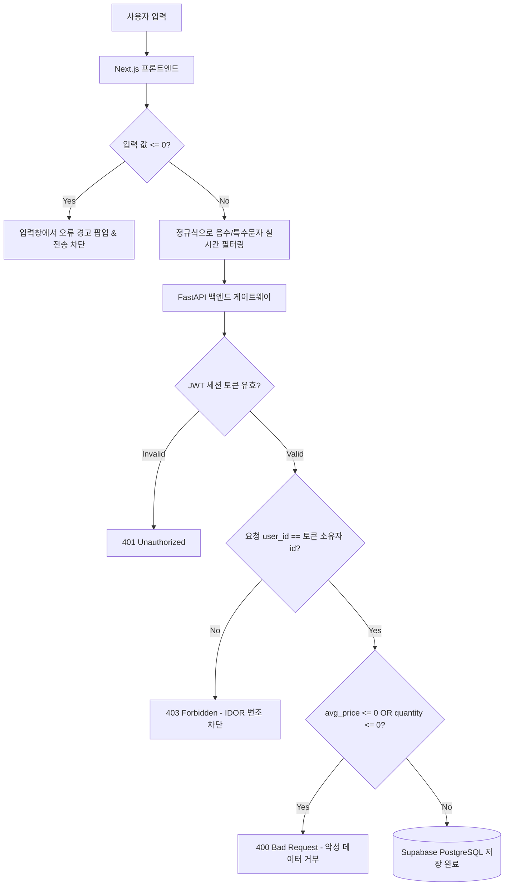

# 🎯 ITYS (I TOLD YOU SO) - 내가 말했제

> **"입으로만 투자하지 말고, 숫자로 박제해라."**  
> 친구들과 수익률 및 비중을 투명하게 공유하며 진짜 투자 실력을 겨루는 프라이빗 소셜 포트폴리오 플랫폼, **ITYS**입니다.

---

## 🌐 아키텍처 및 로직 흐름도 (Architecture & Logic Flowcharts)

### 1. 포트폴리오 평단가 가중 합산 로직 (Weighted Average Merger)
기존에 등록된 종목을 다시 추가할 경우, 중복 행이 생성되는 대신 기존의 수량과 평단가를 바탕으로 **가중 매수 평단가** 및 **누적 수량**을 자동 연산하여 하나의 행으로 스마트하게 관리합니다.



---

### 2. 음수 차단 및 이중 보안 게이트웨이 (Double-Guard Security Protocol)
잘못된 데이터(음수 또는 0 이하)의 유입을 원천 차단하고 타인 자산 변조(IDOR) 공격을 방어하기 위해 프론트엔드와 백엔드 API 게이트웨이 전반에 강력한 보안 필터를 구축하였습니다.



---

## 💎 주요 특징 (Core Features)

* **다중 그룹 워크스페이스**: 여러 개의 친구 모임에 참여하여 각기 다른 멤버들과 격정적인 수익률 서열 순위표 경쟁을 즐깁니다.
* **실시간 리그 랭킹보드**: 매시간 자동으로 갱신되는 국내 시세를 반영한 그룹원 간의 실시간 수익률 순위를 금/은/동 메달로 시각화합니다.
* **"내가 말했제" (예측 박제)**: 
  - 특정 주식 종목의 상승/하락 방향과 목표가, 예측 근거를 박제합니다.
  - 목표 만료일 도달 시 시스템이 실시간 시세와 대조하여 성공/실패 판정을 자동으로 처리합니다.
* **프리미엄 콤마 UX**: 가격과 수량 입력 상자 타이핑 시 실시간 세 자리 단위 쉼표(`,`) 포맷팅을 지원합니다.
* **철저한 프라이버시**: 실제 보유 금액(₩) 노출 여부는 사용자가 직접 온오프 설정 가능합니다.

---

## 🛠️ 기술 스택 (Technical Stack)

| 구분 | 기술 요약 | 상세 역할 |
|---|---|---|
| **Frontend** | Next.js (React), Vanilla CSS Modules | 다크 글래스모피즘 테마 전역 설계, 반응형 레이아웃 |
| **Backend** | FastAPI (Python) | 2-Query 대형 랭킹 연산 최적화, 보안 토큰 검증 의존성 |
| **Database** | Supabase (PostgreSQL) | 고성능 RLS 연동 및 유저 메타데이터 관리 |
| **Scheduler** | APScheduler | 1시간 주기 시세 자동 갱신 및 일일 수익률 스냅샷 저장 |
| **Data Scraping**| FinanceDataReader | 국내 전 종목 시세 스크래핑 엔진 |

---

## 🚀 빠른 시작 가이드 (Quick Start Guide)

프로젝트 루트 디렉토리에서 Docker Compose를 사용하여 Next.js 프론트엔드와 FastAPI 백엔드 서비스를 한 번에 빌드하고 실행할 수 있습니다.

### 1. 컨테이너 서비스 가동 (Rebuild & Start)
```bash
docker compose up -d --build
```

### 2. 가동 상태 모니터링
```bash
# 전체 컨테이너 상태 보기
docker compose ps

# 백엔드/프론트엔드 통합 실시간 로그 보기
docker compose logs -f
```

---

## 🔒 보안 정책 가이드 (Security Rules)

1. **IDOR 취약점 차단**: 자산 수정 및 삭제(`PUT /update`, `DELETE /remove`) 요청 시 데이터베이스 쿼리에 로그인 유저 식별자(`.eq("user_id", current_user.id)`)를 무조건 강제 결합합니다.
2. **소속 그룹원 검증**: 타인의 포트폴리오 자산을 몰래 훔쳐보려 할 때, 백엔드에서 두 사용자가 최소 하나 이상의 그룹을 공유하고 있는지 대조하여 비정상 조회를 차단합니다.
